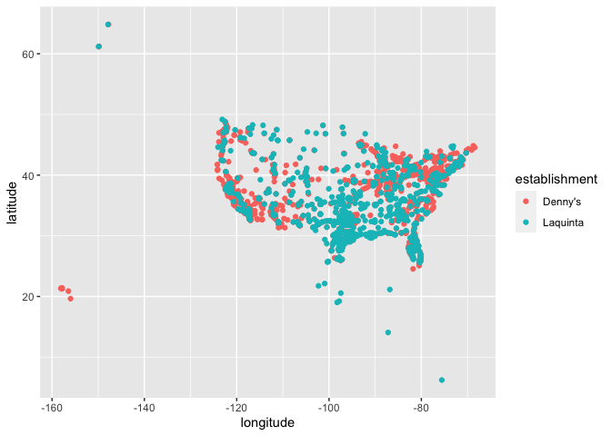
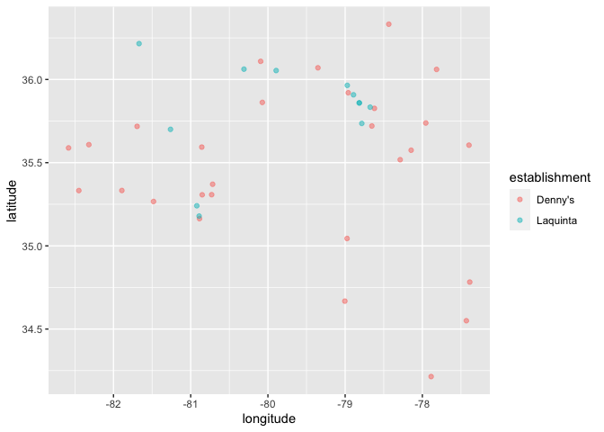
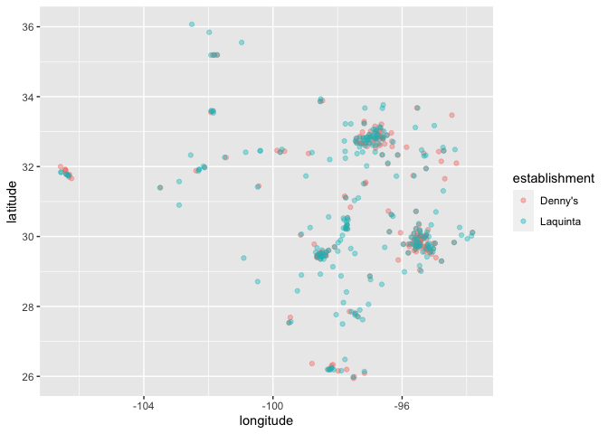

Lab 04
================
Alex Connolly
Feb-16-2022

### Load packages and data

``` r
library(tidyverse) 
```

    ## ── Attaching packages ─────────────────────────────────────── tidyverse 1.3.1 ──

    ## ✓ ggplot2 3.3.5     ✓ purrr   0.3.4
    ## ✓ tibble  3.1.6     ✓ dplyr   1.0.8
    ## ✓ tidyr   1.2.0     ✓ stringr 1.4.0
    ## ✓ readr   2.1.2     ✓ forcats 0.5.1

    ## ── Conflicts ────────────────────────────────────────── tidyverse_conflicts() ──
    ## x dplyr::filter() masks stats::filter()
    ## x dplyr::lag()    masks stats::lag()

``` r
library(dsbox) 
```

``` r
states <- read_csv("data/states.csv")
```

    ## Rows: 51 Columns: 3
    ## ── Column specification ────────────────────────────────────────────────────────
    ## Delimiter: ","
    ## chr (2): name, abbreviation
    ## dbl (1): area
    ## 
    ## ℹ Use `spec()` to retrieve the full column specification for this data.
    ## ℹ Specify the column types or set `show_col_types = FALSE` to quiet this message.

### Exercise 1

``` r
nrow(dennys)
```

    ## [1] 1643

``` r
ncol(dennys)
```

    ## [1] 6

There are 1643 rows and 6 columns, the variables are addresses, city,
states, zips, longitude, latitude. ### Exercise 2

``` r
nrow(laquinta)
```

    ## [1] 909

``` r
ncol(laquinta)
```

    ## [1] 6

909 rows, 6 columns, same variables

### Exercise 3

There are multiple La Quinta locations outside of the US, including
Canada, Mexico, China, New Zealand, Honduras, Turkey, United Arab
Emirates,Chile, Colombia.

No Dennys in other countries.

### Exercise 4

You could filter locations that are from outside the US.

### Exercise 5

``` r
dennys %>%
  filter(!(state %in% states$abbreviation))
```

    ## # A tibble: 0 × 6
    ## # … with 6 variables: address <chr>, city <chr>, state <chr>, zip <chr>,
    ## #   longitude <dbl>, latitude <dbl>

No states are outside the US for Dennys

### Exercise 6

``` r
dennys %>%
  mutate(country = "United States")
```

    ## # A tibble: 1,643 × 7
    ##    address                        city    state zip   longitude latitude country
    ##    <chr>                          <chr>   <chr> <chr>     <dbl>    <dbl> <chr>  
    ##  1 2900 Denali                    Anchor… AK    99503    -150.      61.2 United…
    ##  2 3850 Debarr Road               Anchor… AK    99508    -150.      61.2 United…
    ##  3 1929 Airport Way               Fairba… AK    99701    -148.      64.8 United…
    ##  4 230 Connector Dr               Auburn  AL    36849     -85.5     32.6 United…
    ##  5 224 Daniel Payne Drive N       Birmin… AL    35207     -86.8     33.6 United…
    ##  6 900 16th St S, Commons on Gree Birmin… AL    35294     -86.8     33.5 United…
    ##  7 5931 Alabama Highway, #157     Cullman AL    35056     -86.9     34.2 United…
    ##  8 2190 Ross Clark Circle         Dothan  AL    36301     -85.4     31.2 United…
    ##  9 900 Tyson Rd                   Hope H… AL    36043     -86.4     32.2 United…
    ## 10 4874 University Drive          Huntsv… AL    35816     -86.7     34.7 United…
    ## # … with 1,633 more rows

### Exercise 7

``` r
laquinta %>%
  filter(!(state %in% states$abbreviation))
```

    ## # A tibble: 14 × 6
    ##    address                                  city  state zip   longitude latitude
    ##    <chr>                                    <chr> <chr> <chr>     <dbl>    <dbl>
    ##  1 Carretera Panamericana Sur KM 12         "\nA… AG    20345    -102.     21.8 
    ##  2 Av. Tulum Mza. 14 S.M. 4 Lote 2          "\nC… QR    77500     -86.8    21.2 
    ##  3 Ejercito Nacional 8211                   "Col… CH    32528    -106.     31.7 
    ##  4 Blvd. Aeropuerto 4001                    "Par… NL    66600    -100.     25.8 
    ##  5 Carrera 38 # 26-13 Avenida las Palmas c… "\nM… ANT   0500…     -75.6     6.22
    ##  6 AV. PINO SUAREZ No. 1001                 "Col… NL    64000    -100.     25.7 
    ##  7 Av. Fidel Velazquez #3000 Col. Central   "\nM… NL    64190    -100.     25.7 
    ##  8 63 King Street East                      "\nO… ON    L1H1…     -78.9    43.9 
    ##  9 Calle Las Torres-1 Colonia Reforma       "\nP… VE    93210     -97.4    20.6 
    ## 10 Blvd. Audi N. 3 Ciudad Modelo            "\nS… PU    75010     -97.8    19.2 
    ## 11 Ave. Zeta del Cochero No 407             "Col… PU    72810     -98.2    19.0 
    ## 12 Av. Benito Juarez 1230 B (Carretera 57)… "\nS… SL    78399    -101.     22.1 
    ## 13 Blvd. Fuerza Armadas                     "con… FM    11101     -87.2    14.1 
    ## 14 8640 Alexandra Rd                        "\nR… BC    V6X1…    -123.     49.2

These countries ar Mexico (10 of them), Colombia, Canada (2), and
Hondurus.

### Exercise 8

``` r
laquinta <- laquinta %>%
  mutate(country = case_when(
    state %in% state.abb     ~ "United States",
    state %in% c("ON", "BC") ~ "Canada",
    state == "ANT"           ~ "Colombia",
    state == "FM"            ~ "Honduras",
    state %in% c("AG", "QR", "CH", "NL", "VE", "PU", "SL") ~ "Mexico"
  ))
```

``` r
laquinta %>%
  filter(country == "United States")
```

    ## # A tibble: 895 × 7
    ##    address                         city   state zip   longitude latitude country
    ##    <chr>                           <chr>  <chr> <chr>     <dbl>    <dbl> <chr>  
    ##  1 793 W. Bel Air Avenue           "\nAb… MD    21001     -76.2     39.5 United…
    ##  2 3018 CatClaw Dr                 "\nAb… TX    79606     -99.8     32.4 United…
    ##  3 3501 West Lake Rd               "\nAb… TX    79601     -99.7     32.5 United…
    ##  4 184 North Point Way             "\nAc… GA    30102     -84.7     34.1 United…
    ##  5 2828 East Arlington Street      "\nAd… OK    74820     -96.6     34.8 United…
    ##  6 14925 Landmark Blvd             "\nAd… TX    75254     -96.8     33.0 United…
    ##  7 909 East Frontage Rd            "\nAl… TX    78516     -98.1     26.2 United…
    ##  8 2116 Yale Blvd Southeast        "\nAl… NM    87106    -107.      35.1 United…
    ##  9 7439 Pan American Fwy Northeast "\nAl… NM    87109    -107.      35.2 United…
    ## 10 2011 Menaul Blvd Northeast      "\nAl… NM    87107    -107.      35.1 United…
    ## # … with 885 more rows

### Excercise 9

``` r
dennys %>%
  count(state) %>%
  inner_join(states, by = c("state" = "abbreviation")) %>%
  mutate(Dennys_per_distance = n / area * 1000) %>%
  arrange(Dennys_per_distance)
```

    ## # A tibble: 51 × 5
    ##    state     n name            area Dennys_per_distance
    ##    <chr> <int> <chr>          <dbl>               <dbl>
    ##  1 AK        3 Alaska       665384.             0.00451
    ##  2 MT        4 Montana      147040.             0.0272 
    ##  3 SD        3 South Dakota  77116.             0.0389 
    ##  4 WY        4 Wyoming       97813.             0.0409 
    ##  5 IA        3 Iowa          56273.             0.0533 
    ##  6 ND        4 North Dakota  70698.             0.0566 
    ##  7 NE        5 Nebraska      77348.             0.0646 
    ##  8 LA        4 Louisiana     52378.             0.0764 
    ##  9 KS        8 Kansas        82278.             0.0972 
    ## 10 MS        5 Mississippi   48432.             0.103  
    ## # … with 41 more rows

DC has the most Dennys per thousand square miles, rhode island second.
Delaware has the least Dennys, California has the most.

``` r
laquinta %>%
  count(state) %>%
  inner_join(states, by = c("state" = "abbreviation")) %>%
  mutate(Laquinta_per_distance = n / area * 1000) %>%
  arrange(Laquinta_per_distance)
```

    ## # A tibble: 48 × 5
    ##    state     n name            area Laquinta_per_distance
    ##    <chr> <int> <chr>          <dbl>                 <dbl>
    ##  1 AK        2 Alaska       665384.               0.00301
    ##  2 SD        2 South Dakota  77116.               0.0259 
    ##  3 ME        1 Maine         35380.               0.0283 
    ##  4 WY        3 Wyoming       97813.               0.0307 
    ##  5 MI        4 Michigan      96714.               0.0414 
    ##  6 MT        9 Montana      147040.               0.0612 
    ##  7 NE        5 Nebraska      77348.               0.0646 
    ##  8 ND        5 North Dakota  70698.               0.0707 
    ##  9 IA        4 Iowa          56273.               0.0711 
    ## 10 NV        8 Nevada       110572.               0.0724 
    ## # … with 38 more rows

Here, RI has the most per thousand square miles, FLorida second. Maine
has the least La Quintas, Texas has the most.

### Excersise 10

``` r
dennys <- dennys %>%
  mutate(establishment = "Denny's")
laquinta <- laquinta %>%
  mutate(establishment = "Laquinta")
dennys_laquinta <- bind_rows(dennys, laquinta)
```

``` r
ggplot(dennys_laquinta, mapping = aes(x = longitude, y = latitude, color = establishment)) +
  geom_point()
```

<!-- --> ### Excersise 11

``` r
dennys_laquinta %>%
  filter(state == "NC") %>%
  ggplot(dennys_laquinta, mapping = aes(x = longitude, y = latitude, color = establishment)) + geom_point(alpha=.5) 
```

<!-- --> I mean there
are definitely a lot of Denny’s that are close to Laquintas, but I don’t
think it is as close as Mitch Hedberg suggests.

### Excercise 12

``` r
dennys_laquinta %>%
  filter(state == "TX") %>%
  ggplot(dennys_laquinta, mapping = aes(x = longitude, y = latitude, color = establishment)) + geom_point(alpha=.4) 
```

<!-- -->

This state it holds up a lot better. It does appear that everywhere
there is a Denny’s, there is a Laquinta very close. Way more Laquintas
though.
